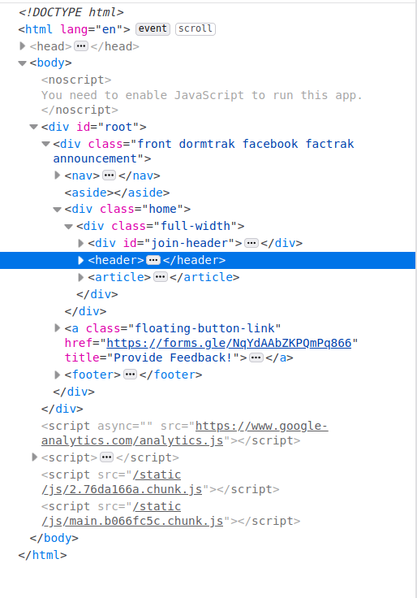

# Developer Tools

Every browser comes with developer tools, which are of great help in the web development process.

## Table of Contents

1. [Inspect Element](#inspect-element)

## Inspect Element

On any browser, right-click on a webpage and select Inspect Element to bring up a menu that looks like this:

The window is split into three sections.

### HTML

This section shows the HTML that is generated for that particular webpage. Note that if you were to select or mouse-over the HTML components here, the corresponding element in the webpage will get highlighted. Use this feature to understand how HTML elements are organized, and learn from them for your websites.

This section is editable, and you can add or remove html elements to see their impact on the final window!

### CSS Rules

This portion shows the CSS rules that are being applied to the selected elements, as well as the stylesheets and selectors that they come from. When the properties are struck through, it means that either it is an invalid property or a later rule is applied over it.

Note that this section is editable - you are able to change the values or add new properties, and the change will be immediately reflected. A tip is to use this section to edit values to vet the results before copying them over to your CSS file.

### CSS Values

This section has three components to it - Layout, Component, and Changes.

The Layout section is useful for summary information on the display style sizes. In particular, Firefox also provides excellent CSS Grid navigation and display which can be accessed here.

This section shows the final values for each CSS property that is applied to the component at hand, as well as the rules that were applied to get them. Useful when your component might be affected by multiple stylesheets and is too troublesome to track down the influence of each one of them.

The final section is used to show the changes for the HTML element over time with a CSS animation.
