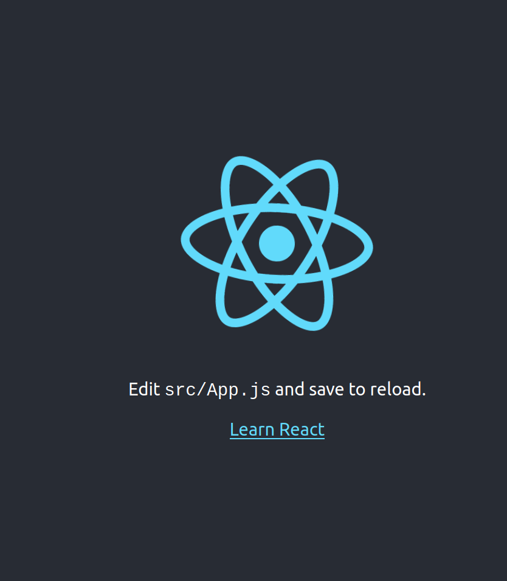

# Create your own personal website (React)

This week, we'll be trying to create our own page on github. While it can serve also as some online presence/ online resume, it is also important for front-end developers to display some of our projects online so that people can look at them and for you to have something to be proud of :) This project mainly focuses on creating components and **styling**, rather than all the other cool features React has.

Suggested Time: 1 week

## Pre-requisites

- Should have done the Personal Website (HTML/CSS) project
- Should have [Node](https://nodejs.org/en/) installed.
- Should have Git installed.

## Table of Contents

1. [Requirements](#requirements)
2. [Setting Up](#setting-up)
3. [Helpful Tips](#helpful-tips)
4. [Further Extensions](#further-extensions)
5. [Past Submissions](#past-submissions)

## Requirements:

1. Must be responsive to mobile (e.g. Resizing the browser window up to a minimum width of 480px should still allow for all content to be seen)
2. Must use at least one of the following libraries:
   - Bulma (https://bulma.io/)
   - Material Design (https://material-ui.com/)
   - Elastic UI (https://github.com/elastic/eui)
   - Fomatic UI (https://fomantic-ui.com/)
   - Grommet (https://v2.grommet.io/)
   - Any other library you find

Challenge: Create a different branch and format everything using just pure CSS.

## Setting Up:

**Initializing the repository and files**

1. Create a new GitHub repository `<github-username>.github.io`. Skip initializing the repository. For excample, if your github username is walnutdust, the repository to make should be `walnutdust.github.io`.
2. Share the repository with your front-end team lead.
3. Open to your local development folder and run the following commands, replacing `<github-username>.github.io` with your actual username as mentioned in step 1:

```bash
$ npx create-react-app <github-username>.github.io
$ cd personal-website
$ git remote add origin https://github.com/<github-username>/<github-username>.github.io.git
$ git add .
$ git commit -m "Initial commit"
$ git push
```

**Add gh-pages package**

`gh-pages` builds your website from the React source code, and publishes them onto the `master` branch.

4. Add gh-pages either via `yarn add gh-pages -D` or `npm install gh-pages --save-dev`.
5. Go to `package.json`, add a homepage to your `package.json` like this:

```json
{
    "name": "My Personal Website",
    "version": "0.1.0",
    "private": true,
    "homepage": "https://<github-username>.github.io/",
    ...
}
```

6. Add the following under scripts of package.json:

```json
"predeploy": "npm run build",
"deploy": "gh-pages -d build -b master”
```

**Changing the default branch**

For personal websites (i.e `<github-username>.github.io`), the website files have to be on the `master` branch. We therefore should create a new branch to store our source code.

7. Manually create a new branch on Github called `source`.
8. Run the following commands:

```bash
$ git pull
$ git checkout source
```

9. Your local environment should now be in the `source` branch. To verify,

```
$ git status
On branch source
Your branch is up to date with 'origin/source'.

nothing to commit, working tree clean
```

10. Open your respository on GitHub, and navigate to settings.
11. On the left-side panel, click "branches"
12. Set the default branch to `source`.

**Development!**

At this point, you should be all set to develop!

13. Type `yarn` to install the dependencies, and once that is done, type `yarn start` and begin to develop your website in React! You should get a screen that looks like:
    
14. You can now edit your code on your preferred IDE and view your changes live in your browser each time you save! Refer to the [crash course document](react-crash-course.md) for some guidance on working with React. Starter code using the Elastic UI library, as well as instructions is available in the starter code folder - refer to the [README](./Starter%20Code/README.md). Past submissions from other students can be found [below](#Past-submissions).
15. Although you don't really need it, there's a Javascript Crash course [here](../Hacker%20News%20Application/js-crash-course.md) as well.

**Deployment**

16. `$ npm run deploy` or `$ yarn deploy`
17. You should now be able to view your website at `https://<github-username>.github.io/`

## Helpful Tips:

- Set up Prettier (https://prettier.io/) or ESLint (https://eslint.org/) if you haven’t already - these help to catch certain errors and make formatting a lot easier.
- Ensure Responsive Design:
  - Remember to avoid using absolute numbers for most widths/heights where possible.
  - Look into CSS grid/ flexbox for help with responsive design.
  - Consider using em/rem for font sizes, although they may not be necessary most of the time.
- Note that React is typically used for Single-Page Applications (SPA), and while there are methods to get them to act as multi-page websites (typically by using a Router, although for personal blogs we personally recommend using Gatsby instead)
- Know how to use your [Developer Tools](../Basic%20Tools/Developer%20Tools.md)!

## Further Extensions

Recreate your personal website with Gatsby (gatsbyjs.org/)! Gatsby offers Search Engine Optimization, routing, and image optimization, which can improve the performance of your website.

## Past Submissions:

Found below are submissions from students who have previously completed this project, and consented to sharing their repository here. Note that they might have completed the project with different requirements, but nonetheless are good resources to see how other people might have tackled this project.

1. Kaizen Conroy's Personal Website - [Code](https://github.com/kaizen3031593/kaizen3031593.github.io/tree/source) [Website](https://kaizen3031593.github.io/)
2. Elijah Tamarchenko's Personal Website - [Code](https://github.com/Conqueror1776/Conqueror1776.github.io) [Website](https://conqueror1776.github.io/)
